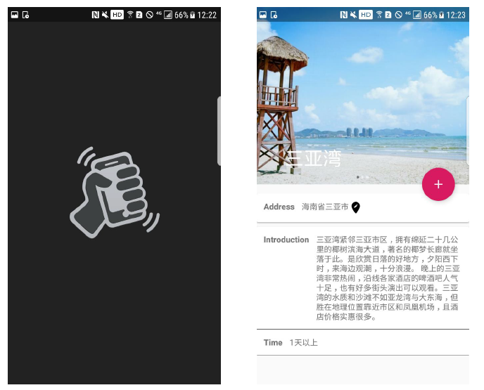

# EasyGo
>移动应用开发课程项目
>
>1651701 魏楠
>
>1651760 罗宇

1. 注册界面

   - 界面截图

     

   - 功能介绍

     - 输入用户名、邮箱和密码，并要求二次输入密码
     - 密码输入栏和二次密码输入栏右侧按钮选择显示或者不显示密码
     - 检测邮箱正确性（只检测形式正确）
     - 检测密码复杂度（八位，至少一个大小写字母，一个数字，一个特殊字符）
     - 检测满足上述条件时，向服务端发出注册请求，成功后跳转到登陆界面

2. 登录界面

   - 界面截屏

     

   - 功能介绍

     - 输入用户名和密码
     - 密码输入栏右侧按钮选择显示或者不显示密码
     - 以输入的用户名和密码向服务端发出登陆请求，登陆成功跳转到行程界面
     - 利用本地数据库实现持久化登陆

3. 行程界面

   3.1 行程记录界面

   - 界面截屏

     

   - 功能介绍

     - 点击右下角添加按钮跳转到新行程添加界面
     - 点击右下角保存按钮保存当前行程，跳转到建立一次新旅程的界面
     - 点击右下角路线规划按钮，跳转到行程规划界面
     - 点击左上角菜单按钮或从左向右侧滑屏幕弹出侧滑菜单
     - 点击行程跳转到行程详情界面
     - 长按行程实现行程拖拽排序
     - 从右向左侧滑行程，实现行程删除

   3.2 行程添加界面

   - 界面截屏

     

   - 功能介绍

     - 地址输入栏添加地址，点击后跳转到高德地图关键字检索POI 界面
     - 日期输入栏添加日期，点击后弹出日期选择对话框
     - 时间输入栏添加时间，点击后弹出时间选择对话框
     - 类型选择栏选择类型，点击后弹出类型选择下拉列表
     - 开销输入栏输入开销
     - 备注输入栏输入备注
     - 点击右下角确认按钮，确认添加行程

   3.3 行程规划界面

   - 界面截屏

     

   - 功能介绍
     - 根据行程在列表中的先后，标记现有行程列表中起点、途经点、终点位置
     - 根据行程地址的经纬度数据，调用高德地图线路规划API 进行线路规划

4. 成就界面

   4.1 足迹地图界面

   - 界面截屏

     

   - 功能介绍

     - 上半部分展示用户成就地图界面，未解锁省份为白色，解锁省份随机上色
     - 点击成就地图中的未解锁省份，弹出对应省份解锁对话框
     - 省份成就解锁对话框中包含解锁该省份按钮以及查看该省份景点按钮
     - 点击解锁省份按钮在成就地图上为该省份上色，解锁该省份
     - 点击查看该该省份景点按钮，跳转该省份景点介绍列表
     - 点击成就地图中的解锁省份，弹出已解锁省份对话框
     - 点击已解锁省份对话框中查看游记按钮，跳转到该省份游记列表
     - 下半部分展示用户解锁省份数量信息以及已编写游记数量信息

   4.2 省份成就界面

   - 界面截屏

     

   - 功能介绍

     - 以列表的形式展示所有省份，未解锁省份黑白显示，已解锁省份彩色显示
     - 点击未解锁省份，跳转到该省份景点介绍列表
     - 点击已解锁省份，跳转到该省份游记列表

5. 游记界面

   5.1 游记列表界面

   - 界面截屏

     

   - 功能介绍

     - 搜索栏为游记过滤器，通过省份信息过滤游记
     - 游记列表中展示所有已保存游记
     - 点击游记查看游记详情
     - 点击右下角添加按钮，跳转到游记添加界面

   5.2 游记详情界面

   - 界面截屏

     

   - 功能介绍

     - 折叠式工具栏中展示一张本次游记的照片
     - 点击修改按钮，跳转到游记编辑界面
     - 点击删除按钮，删除当前游记并同步到服务器
     - 标题栏展示本次游记标题
     - 日期栏展示本次游记撰写日期
     - 地点栏展示本次游记记录的游玩地点
     - 好友栏展示本次游记同行好友
     - 内容栏展示本次游记主要记录内容

   5.3 游记添加界面

   - 界面截屏

     

   - 功能介绍

     - 折叠式工具栏中展示一张本次游记的照片
     - 点击相机按钮，选择本地图片添加为本次游记的照片
     - 点击确认按钮，保存本次游记并同步更新到服务器
     - 标题输入栏输入标题（要求不能为空）
     - 日期输入栏添加游记撰写日期，点击后弹出日期选择对话框
     - 地址输入栏添加地址，点击后跳转到高德地图关键字检索POI 界面
     - 好友输入栏输入同行好友
     - 内容输入栏输入本次游记的主体内容

6. 景点界面

   6.1 景点列表界面

   - 界面截屏

     

   - 功能介绍

     - 搜索栏为景点过滤器，通过键入的省份关键字过滤景点介绍
     - 景点简介包含景点名称，位置以及一张景点图片
     - 点击旋转旋转，跳转到摇一摇界面

   6.2 景点详情界面

   - 界面截屏

     

   - 功能介绍

     - 轮播图展示三张景点图片
     - 点击添加按钮，跳转到行程添加界面
     - 地址栏展示景点地址
     - 介绍栏展示景点相关介绍
     - 时间栏展示景点推荐游玩时间

7. 旅程界面

   7.1 旅程列表界面

   - 界面截屏

     

   - 功能介绍

     - 旅程列表列出所有已添加旅程
     - 点击旅程，跳转到被点击旅程对应的行程列表界面
     - 点击添加按钮，跳转到一个空的行程列表界面，添加新行程

   7.2 旅程添加界面

   - 界面截屏

     

   - 功能介绍

     - 标题栏输入旅程标题
     - 备注栏输入旅程相关备注 

8. 清单界面

   - 界面截屏

     

   - 功能介绍

     - 输入栏输入要携带的物品的名称
     - 带勾选框的物品名称列表记录物品携带情况
     - 点击添加按钮，添加输入栏输入名称对应的物品
     - 点击删除按钮，删除输入栏输入名称对应的物品

9. 摇一摇界面

   - 界面截屏

     

   - 功能介绍

     - 通过传感器响应用户的摇一摇行为，随机向用户推荐景点

       

